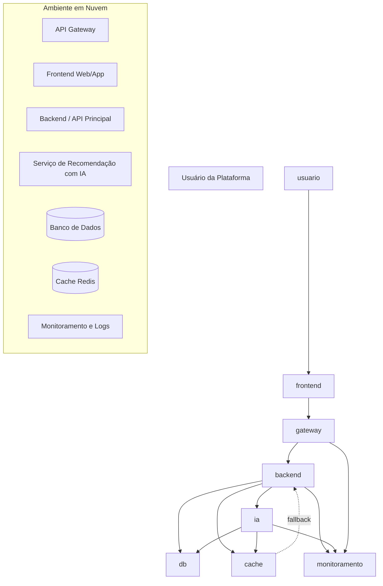

# Arquitetura - Mini Projeto "O Arquiteto Decisor"

Aluno: Athos Lial Passos  
Matrícula: 2320071  
Repositório: https://github.com/laiLsohtA/Arquitetura.git

## Visão executiva do sistema

Este projeto apresenta a arquitetura de um **Sistema de Recomendação de Filmes com IA**. A ideia do sistema é ajudar o usuário a encontrar filmes com mais facilidade dentro de uma plataforma de streaming, usando dados como histórico de visualização, preferências e comportamento de uso.

Nos ciclos anteriores, o projeto foi evoluindo aos poucos. No Ciclo 1 foi definida a visão geral do sistema, seus requisitos não funcionais e o primeiro diagrama de contexto. No Ciclo 2, a arquitetura foi detalhada em containers, separando Frontend, Backend/API Principal, Serviço de Recomendação com IA, Banco de Dados e Cache.

Na Fase 3, o foco passou a ser deixar essa arquitetura mais próxima de um cenário real de produção, pensando em **cloud, escalabilidade e resiliência**. Por isso, foram adicionadas decisões sobre implantação em nuvem, padrões de tolerância a falhas e comunicação entre os serviços.

## Problema que o sistema resolve

Em plataformas de streaming, muitos usuários passam mais tempo procurando algo para assistir do que realmente assistindo. O sistema busca diminuir esse problema oferecendo recomendações personalizadas de filmes.

Sem a recomendação, a plataforma funcionaria praticamente como um catálogo comum. Com o serviço de IA, ela passa a ter um diferencial maior, pois consegue sugerir conteúdos de acordo com o perfil do usuário.

## Evolução do projeto por ciclos


O projeto foi desenvolvido ao longo do semestre em ciclos, evoluindo de uma visão mais geral da arquitetura até uma proposta mais próxima de um ambiente real de produção.


\### Ciclo 1 - Visão e Requisitos


No Ciclo 1, foi definida a visão inicial do sistema. O projeto escolhido foi um \*\*Sistema de Recomendação de Filmes com IA\*\*, voltado para plataformas de streaming.


O problema principal identificado foi a dificuldade que muitos usuários têm para encontrar rapidamente um filme ou conteúdo de seu interesse. Em vez de funcionar apenas como um catálogo estático, o sistema utiliza dados como histórico de visualização, preferências e comportamento do usuário para gerar recomendações personalizadas.


Nessa fase, também foram definidos os principais requisitos não funcionais da arquitetura:


| Requisito não funcional | Descrição                                                                                            |

| ----------------------- | ---------------------------------------------------------------------------------------------------- |

| Performance             | O sistema deve retornar a lista de recomendações em menos de 3 segundos, sempre que possível.        |

| Escalabilidade          | A arquitetura deve suportar aumento no número de usuários e picos de acesso.                         |

| Manutenibilidade        | O serviço de IA deve poder ser atualizado sem interromper toda a plataforma.                         |

| Confiabilidade          | Em caso de falha na IA, o sistema deve oferecer uma alternativa, como filmes populares.              |

| Segurança               | Histórico e preferências do usuário devem ser protegidos e acessados apenas com autenticação válida. |


Também foi produzido um \*\*Diagrama de Contexto C4 - Nível 1\*\*, mostrando a interação entre o usuário, o sistema de recomendação e o serviço de IA. Esse diagrama ajudou a visualizar o sistema de forma mais geral, sem entrar ainda nos detalhes internos da arquitetura.


A estratégia arquitetural definida nessa fase foi classificada como \*\*balanceada\*\*, pois buscava equilibrar inovação, escalabilidade e manutenção. A escolha por separar o serviço de IA da plataforma principal trouxe mais flexibilidade, mas também aumentou a complexidade de integração.


O principal ADR do Ciclo 1 foi:


\* \*\*ADR 001 - Adoção de Arquitetura de Microserviços para o Serviço de IA\*\*


Essa decisão foi tomada porque o sistema precisava processar dados de vários usuários sem prejudicar a plataforma principal de streaming. A arquitetura monolítica foi rejeitada por dificultar a escalabilidade e a manutenção do serviço de recomendação.


\---


\### Ciclo 2 - Blueprint e Decisões


No Ciclo 2, a arquitetura foi detalhada por meio de um \*\*Diagrama de Containers C4 - Nível 2\*\*. Essa fase aprofundou a estrutura interna do sistema e mostrou como os principais componentes se comunicam.


Os containers definidos foram:


\* \*\*Frontend Web/App\*\*: responsável pela interface do usuário;

\* \*\*Backend/API Principal\*\*: responsável por autenticação, regras principais e orquestração das requisições;

\* \*\*Serviço de Recomendação com IA\*\*: responsável por processar dados e gerar sugestões personalizadas;

\* \*\*Banco de Dados\*\*: responsável por armazenar usuários, histórico de visualização e preferências;

\* \*\*Cache\*\*: responsável por armazenar recomendações recentes e melhorar o desempenho.


O fluxo principal definido no Ciclo 2 funciona da seguinte forma: o usuário acessa o Frontend, que envia a requisição ao Backend. O Backend valida o usuário, consulta o Banco de Dados e envia as informações necessárias ao Serviço de Recomendação com IA. Depois que a IA retorna as recomendações, o Backend pode armazenar o resultado em cache e devolver a resposta ao usuário.


O estilo arquitetural escolhido foi \*\*Microsserviços\*\*. Essa escolha foi feita porque o sistema possui responsabilidades diferentes que precisam evoluir separadamente, principalmente a plataforma principal e o serviço de IA.


A decisão trouxe benefícios importantes, como:


\* permitir que o Serviço de IA seja escalado separadamente;

\* facilitar atualizações no modelo de recomendação;

\* melhorar a organização da arquitetura;

\* reduzir o impacto de mudanças em partes específicas do sistema.


Por outro lado, também foram identificados alguns trade-offs:


\* maior complexidade na comunicação entre serviços;

\* necessidade de monitoramento mais cuidadoso;

\* possibilidade de aumento de latência;

\* mais pontos de falha em comparação com uma arquitetura monolítica.


O principal ADR do Ciclo 2 foi:


\* \*\*ADR 002 - Adoção de API REST para Comunicação entre Backend e Serviço de IA\*\*


A comunicação REST síncrona foi escolhida porque o usuário espera receber recomendações em tempo real. Assim, o Backend envia os dados para o Serviço de IA e aguarda a resposta com a lista de filmes recomendados.


A alternativa rejeitada foi o uso de comunicação assíncrona por fila de mensagens. Apesar de ser uma opção interessante para alguns cenários, ela aumentaria a complexidade do projeto e não seria a melhor escolha para recomendações solicitadas em tempo real.


\---


\### Ciclo 3 - Cloud e Resiliência


No Ciclo 3, a arquitetura evoluiu para considerar um cenário de produção em nuvem. O foco passou a ser a implantação da solução, a escalabilidade dos serviços e a resiliência em caso de falhas.


A proposta da Fase 3 mantém a arquitetura baseada em microsserviços, mas adiciona elementos importantes para um ambiente real, como:


\* implantação em cloud;

\* API Gateway;

\* escalabilidade horizontal;

\* cache com Redis;

\* timeout;

\* retry controlado;

\* Circuit Breaker;

\* fallback;

\* monitoramento e logs.


A principal preocupação nessa fase foi a dependência entre o Backend/API Principal e o Serviço de Recomendação com IA. Como a comunicação entre eles é síncrona, uma falha ou lentidão no serviço de IA poderia prejudicar a experiência do usuário.


Para reduzir esse risco, foram propostas estratégias de resiliência. Caso a IA fique indisponível, o sistema poderá retornar recomendações populares ou recomendações armazenadas anteriormente no cache. Dessa forma, mesmo com falhas parciais, a plataforma continua oferecendo uma resposta útil ao usuário.


Os ADRs da Fase 3 documentam as decisões sobre nuvem, resiliência e modelo de comunicação:


\* \[ADR 0001 - Estratégia de Nuvem e Escalabilidade](docs/adrs/0001-estrategia-nuvem.md)

\* \[ADR 0002 - Padrões de Resiliência](docs/adrs/0002-padrao-resiliencia.md)

\* \[ADR 0003 - Modelo de Comunicação](docs/adrs/0003-modelo-comunicacao.md)


## Estado atual da arquitetura na Fase 3

A arquitetura atual segue o estilo de **microsserviços**, separando as responsabilidades principais:

* Frontend Web/App para interação com o usuário;
* Backend/API Principal para autenticação, regras principais e orquestração;
* Serviço de Recomendação com IA para gerar recomendações;
* Banco de Dados para guardar usuários, histórico e preferências;
* Cache para armazenar recomendações recentes;
* API Gateway para organizar o acesso aos serviços;
* Estratégias de resiliência como timeout, fallback e circuit breaker.

## Requisitos não funcionais priorizados

|RNF|Descrição|
|-|-|
|Performance|O sistema deve retornar recomendações em menos de 3 segundos sempre que possível.|
|Escalabilidade|O serviço de IA precisa conseguir crescer em momentos de pico.|
|Manutenibilidade|O serviço de recomendação deve poder evoluir sem parar toda a plataforma.|
|Confiabilidade|Em caso de falha na IA, o usuário ainda deve receber alguma resposta útil.|
|Segurança|Histórico e preferências do usuário devem ser acessados apenas com autenticação válida.|

## Diagrama C4 de Containers - Fase 3



## Fluxo principal

1. O usuário acessa o Frontend e solicita recomendações.
2. O Frontend envia a requisição para o Backend passando pelo API Gateway.
3. O Backend valida o usuário e consulta dados necessários no Banco de Dados.
4. Antes de chamar a IA, o Backend verifica se já existe recomendação recente no Cache.
5. Se não houver cache, o Backend chama o Serviço de Recomendação com IA.
6. O Serviço de IA processa os dados e retorna uma lista de filmes.
7. O Backend salva o resultado no Cache e devolve a resposta ao Frontend.
8. Caso a IA falhe, o sistema usa fallback com recomendações populares ou antigas.

## Decisões arquiteturais da Fase 3

Os ADRs obrigatórios estão na pasta `/docs/adrs/`:

* [ADR 0001 - Estratégia de Nuvem e Escalabilidade](docs/adrs/0001-estrategia-nuvem.md)
* [ADR 0002 - Padrões de Resiliência](docs/adrs/0002-padrao-resiliencia.md)
* [ADR 0003 - Modelo de Comunicação](docs/adrs/0003-modelo-comunicacao.md)

## SAD da Fase 3

O documento SAD está em:

* [SAD - Fase 3](docs/sad/sad-fase3.md)

## Bônus - Gold Plating

A pasta `/gold-plating/` contém materiais extras para mostrar uma evolução além do mínimo pedido:

* [Plano de Resiliência](gold-plating/plano-resiliencia.md)
* [Checklist de Observabilidade](gold-plating/checklist-observabilidade.md)
* [Diagrama extra de resiliência](gold-plating/diagrama-resiliencia.mmd)

A melhoria principal do bônus foi documentar melhor como o sistema se comporta quando o Serviço de Recomendação com IA falha ou fica lento.

## Como executar o projeto localmente

Este repositório é principalmente arquitetural e documental. Mesmo assim, a estrutura considera uma futura implementação dividida em serviços.

### Pré-requisitos sugeridos

* Node.js ou outra stack escolhida para o Backend;
* Docker instalado;
* Git instalado;
* Banco de dados relacional;
* Redis para cache.

### Passos sugeridos

```bash
git clone https://github.com/laiLsohtA/Arquitetura.git
cd Arquitetura
```

Caso os serviços sejam implementados futuramente com Docker, a execução poderá seguir uma ideia parecida com:

```bash
docker compose up --build
```

Como o foco da entrega é a documentação arquitetural, os arquivos principais a serem avaliados estão em `README.md`, `/docs/adrs/`, `/docs/sad/` e `/gold-plating/`.

## Referências

* Pressman, R. S. Engenharia de Software: Uma Abordagem Profissional.
* Richards, M.; Ford, N. Fundamentals of Software Architecture.
* Newman, S. Building Microservices.
* Fowler, M. Patterns of Enterprise Application Architecture.
* C4 Model for Software Architecture.
* Architecture Decision Records.

