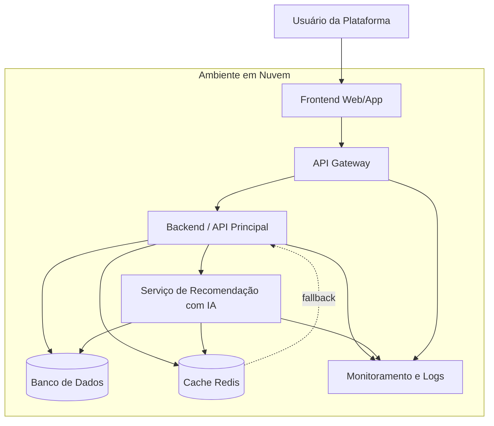

# SAD - Software Architecture Document - Fase 3

## 1. Introdução

Este documento apresenta a arquitetura da Fase 3 do Mini Projeto "O Arquiteto Decisor". O sistema escolhido é uma plataforma de recomendação de filmes com uso de Inteligência Artificial.

A proposta é que o usuário receba sugestões personalizadas com base no histórico de visualização, preferências e dados de uso. A Fase 3 evolui o projeto para um cenário de cloud e microsserviços, considerando implantação, escalabilidade e resiliência.

## 2. Objetivos da arquitetura

Os principais objetivos da arquitetura são:

- separar as responsabilidades do sistema;
- permitir que o Serviço de Recomendação com IA seja escalado separadamente;
- manter bom tempo de resposta para o usuário;
- reduzir o impacto de falhas no Serviço de IA;
- facilitar manutenção e evolução futura do projeto;
- organizar a documentação arquitetural no GitHub.

## 3. Visão geral

A arquitetura é baseada em microsserviços. O Frontend é responsável pela interface do usuário. O Backend/API Principal organiza as requisições, autentica o usuário e coordena o fluxo. O Serviço de Recomendação com IA processa os dados e gera sugestões. O Banco de Dados armazena dados principais e o Cache guarda recomendações recentes.

Na Fase 3, a arquitetura inclui também API Gateway, monitoramento, logs e padrões de resiliência.

## 4. Containers principais

| Container | Responsabilidade |
| --- | --- |
| Frontend Web/App | Interface usada pelo usuário para visualizar recomendações. |
| API Gateway | Entrada das requisições, controle de acesso e limite de chamadas. |
| Backend/API Principal | Autenticação, regras principais e orquestração das recomendações. |
| Serviço de Recomendação com IA | Analisa dados do usuário e gera recomendações personalizadas. |
| Banco de Dados | Armazena usuários, histórico, preferências e informações de filmes. |
| Cache Redis | Guarda recomendações recentes para reduzir chamadas à IA. |
| Monitoramento | Acompanha logs, falhas, latência e disponibilidade. |

## 5. Diagrama C4 de Containers

## 6. Decisões arquiteturais

As principais decisões da Fase 3 foram:

1. Implantar a solução em nuvem usando containers e serviços gerenciados.
2. Escalar horizontalmente os serviços, principalmente o Serviço de IA.
3. Usar Circuit Breaker, timeout, cache e fallback para melhorar a resiliência.
4. Manter comunicação REST síncrona para recomendações em tempo real.
5. Documentar as decisões em ADRs separados.

## 7. Estratégia de cloud

A implantação em cloud foi pensada para usar uma combinação de containers com serviços gerenciados. O Frontend pode ser hospedado em um serviço próprio para aplicações web. O Backend e o Serviço de IA podem rodar em containers. O Banco de Dados pode usar um serviço gerenciado e o Cache pode usar Redis gerenciado.

Essa estratégia foi escolhida porque reduz a necessidade de configurar toda a infraestrutura manualmente e permite que cada parte do sistema cresça conforme a demanda.

## 8. Resiliência

O ponto mais sensível da arquitetura é a dependência do Backend em relação ao Serviço de IA. Para reduzir esse risco, a arquitetura usa:

- timeout;
- retry controlado;
- circuit breaker;
- fallback;
- cache;
- monitoramento e logs.

Com isso, se o Serviço de IA falhar, o sistema ainda pode mostrar filmes populares ou recomendações salvas anteriormente.

## 9. Comunicação entre serviços

A comunicação principal será feita por API REST síncrona. Essa escolha foi mantida porque o usuário espera receber as recomendações no momento da solicitação.

Mesmo assim, a arquitetura deixa espaço para comunicação assíncrona no futuro em tarefas que não precisam de resposta imediata, como métricas, relatórios ou atualização de modelos.

## 10. Requisitos não funcionais atendidos

| RNF | Como a arquitetura atende |
| --- | --- |
| Performance | Uso de cache e timeout para evitar respostas muito lentas. |
| Escalabilidade | Serviços em containers podem crescer horizontalmente. |
| Manutenibilidade | Cada serviço tem uma responsabilidade separada. |
| Confiabilidade | Fallback e circuit breaker reduzem o impacto de falhas. |
| Segurança | API Gateway ajuda a controlar acesso e requisições. |

## 11. Riscos

| Risco | Mitigação |
| --- | --- |
| Serviço de IA indisponível | Fallback com filmes populares ou cache. |
| Pico de tráfego | Escalabilidade horizontal. |
| Latência entre serviços | Cache, timeout e monitoramento. |
| Falha de banco de dados | Serviço gerenciado com backup e replicação. |
| Custo alto em cloud | Monitoramento de uso e ajuste de recursos. |

## 12. Conclusão

A arquitetura proposta é adequada para o projeto porque mantém a separação dos serviços, melhora a escalabilidade e prepara o sistema para falhas comuns em produção. O uso de cloud, cache, API Gateway e padrões de resiliência torna o sistema mais confiável e mais próximo de uma arquitetura usada em projetos reais.
